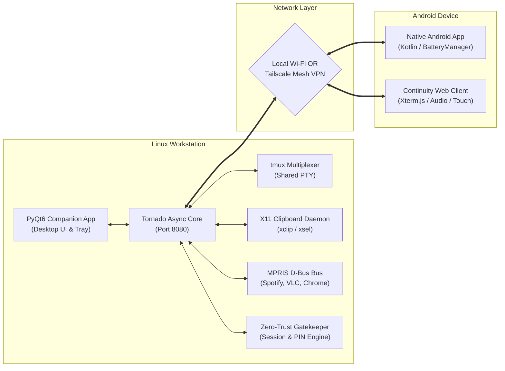
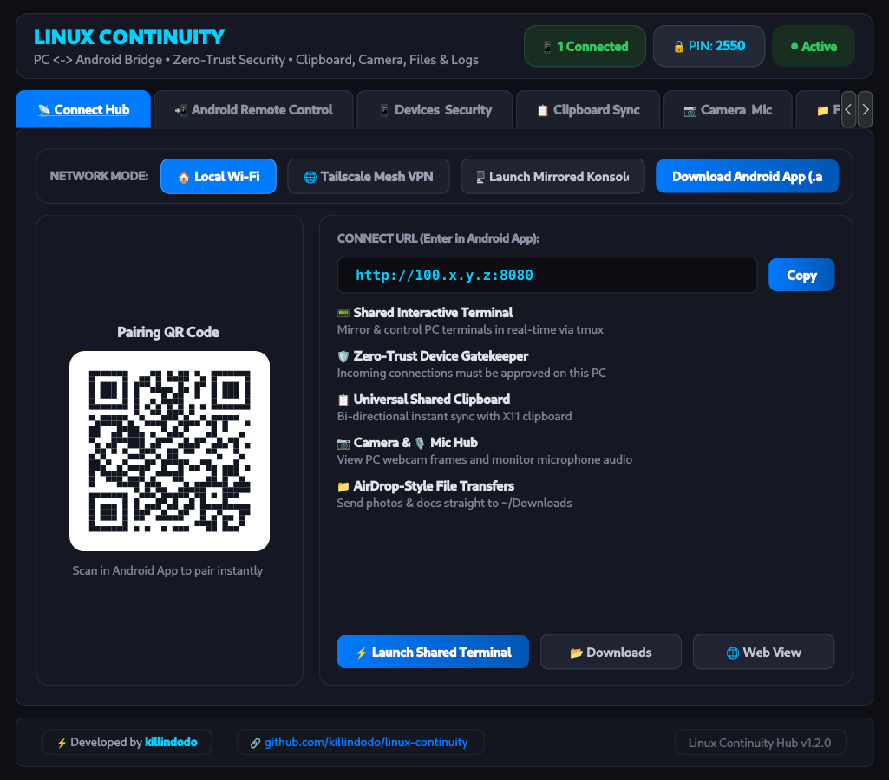
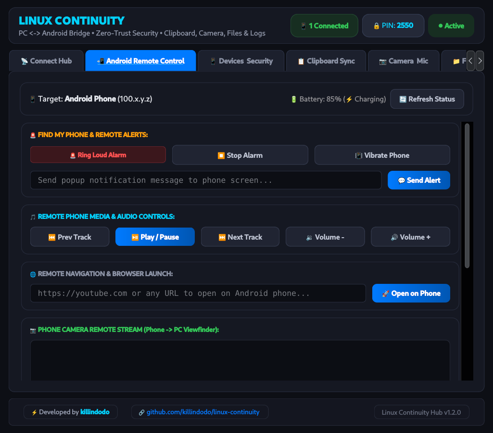
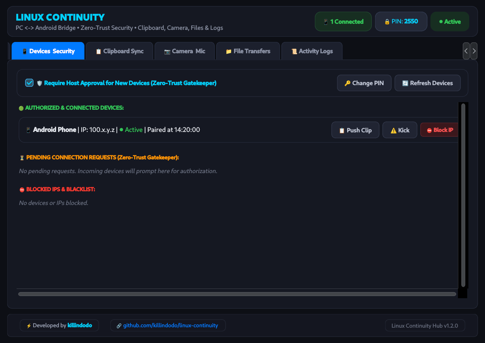
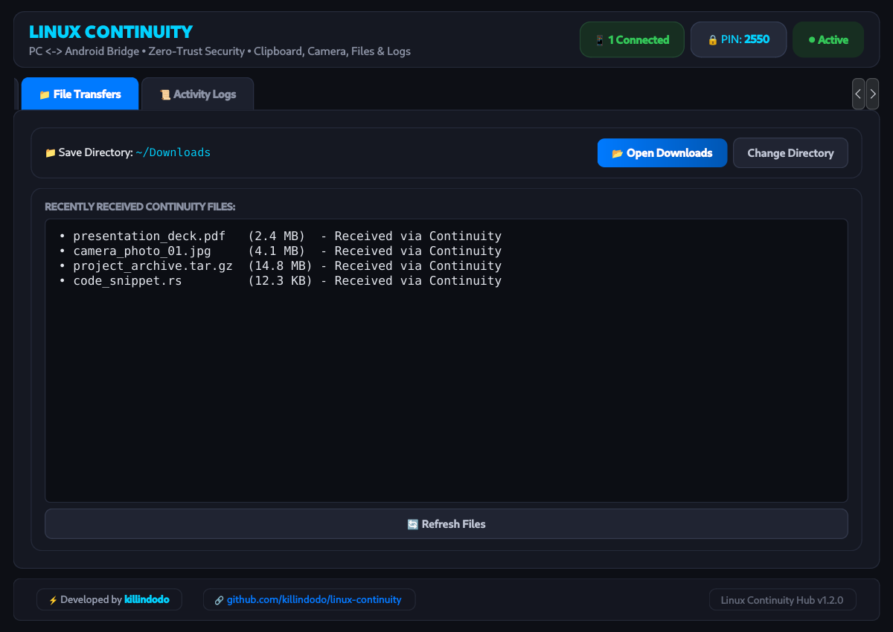
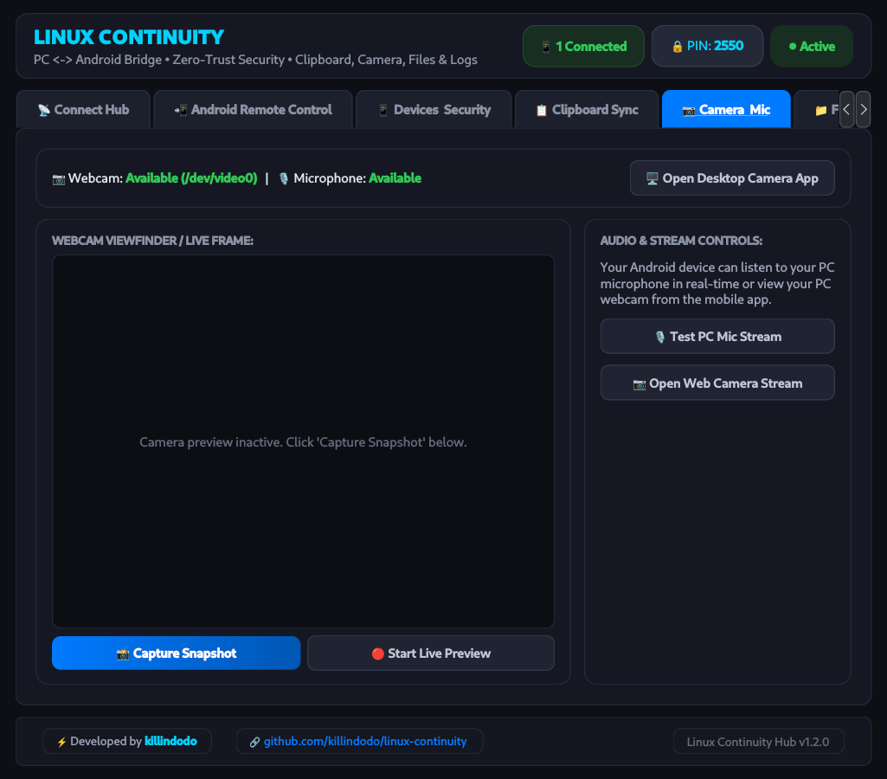

# Linux Continuity

An Apple-style continuity ecosystem bridging Linux workstations and Android devices. Seamlessly synchronize clipboards, watch and interact with live terminal sessions, transfer files with AirDrop speed, control Android hardware remotely, inspect live system vitals, and manage device security with zero-trust pairing.

[](LICENSE)
[](https://github.com/killindodo/linux-continuity/releases/latest)
[](https://github.com/killindodo/linux-continuity/releases/latest/download/LinuxContinuity.apk)
[](https://www.python.org/)
[](https://riverbankcomputing.com/software/pyqt/)
[](#prerequisites)
[](android/)

---

## Table of Contents

- [Overview & Architecture](#overview--architecture)
- [Visual Walkthrough](#visual-walkthrough)
- [Key Features](#key-features)
  - [Zero-Trust Device Gatekeeper & Security](#zero-trust-device-gatekeeper--security)
  - [Android Remote Control & Hardware Telemetry](#android-remote-control--hardware-telemetry)
  - [Shared Interactive Terminals (tmux)](#shared-interactive-terminals-tmux)
  - [AirDrop-Style File Transfers & PC Directory Browser](#airdrop-style-file-transfers--pc-directory-browser)
  - [Universal Shared Clipboard](#universal-shared-clipboard)
  - [Remote Hardware Vitals & MPRIS Media Control](#remote-hardware-vitals--mpris-media-control)
  - [Webcam Viewfinder & Audio Streaming](#webcam-viewfinder--audio-streaming)
- [Prerequisites](#prerequisites)
- [Installation Guide](#installation-guide)
- [Connecting Your Phone](#connecting-your-phone)
  - [Option A: Native Android Companion App (Recommended)](#option-a-native-android-companion-app-recommended)
  - [Option B: Progressive Web App / Mobile Browser](#option-b-progressive-web-app--mobile-browser)
  - [Remote Access via Tailscale Mesh VPN](#remote-access-via-tailscale-mesh-vpn)
- [Architecture & Internal Data Flow](#architecture--internal-data-flow)
- [Configuration & Autostart](#configuration--autostart)
- [Troubleshooting & FAQ](#troubleshooting--faq)
- [Author & License](#author--license)

---

## Overview & Architecture

Linux Continuity was designed to give Linux desktop users the frictionless device continuity enjoyed on proprietary platforms, without reliance on cloud servers or proprietary vendor ecosystems. 

The system operates across two core tiers:
1. **Linux Core Engine & Desktop Hub (`app.py` / `server.py`):** An asynchronous event-driven Tornado daemon combined with a desktop PyQt6 control center. It manages local PTY multiplexing, clipboard polling via `xclip`, live MPRIS media bus inspection, and device session authentication.
2. **Android Client Layer:** A native Android application (`android/`) powered by Kotlin and Android Jetpack, with an embedded Web App client capable of running standalone in any modern mobile browser or progressive web app (PWA) container.



---

## Visual Walkthrough

### 1. Connect Hub
Displays active connection URLs, dynamic QR pairing code, Tailscale mesh VPN toggles, and terminal mirroring shortcuts:



### 2. Android Remote Control & Live Battery Telemetry
Control Android alerts, trigger ringers ("Find My Phone"), adjust mobile volume, open URLs, and view live battery and charging metrics reported natively by the phone:



### 3. Zero-Trust Device Gatekeeper & Session Manager
Review real-time connected clients, approve or reject incoming mobile handshake requests, kick sessions, and manage IP blacklists:



### 4. AirDrop-Style File Transfers & Custom Save Locations
Drop files seamlessly from mobile directly into `~/Downloads` or any custom configured PC directory with write notifications:



### 5. Remote Webcam & Microphone Hub
Inspect PC camera snapshots and monitor workstation microphone audio remotely:



---

## Key Features

### Zero-Trust Device Gatekeeper & Security
- **4-Digit Security PIN:** Protects the workstation against unauthorized network scans on local networks.
- **On-Screen Desktop Approval:** When a new device enters the PIN, an interactive PyQt6 dialog immediately alerts the Linux user to explicitly approve or deny access.
- **Session Tokens:** Cryptographically random UUID session tokens prevent token replay.
- **Real-Time Client Inspection:** View all active IP addresses, device models, idle timers, and kick or blacklist rogue clients with one click.

### Android Remote Control & Hardware Telemetry
- **Find My Phone Alarm:** Remotely trigger an alarm ringtone on the Android device with one tap from the PC desktop.
- **Haptic Vibration:** Send single or pulsed vibration signals to the phone.
- **On-Screen Toast Alerts:** Dispatch instant messages to appear on the Android display.
- **Media & Volume Control:** Remotely raise/lower Android media volume and send media playback key events (`play/pause`, `next`, `prev`).
- **Live Battery Telemetry:** Reads actual battery capacity and AC charging status via native Android `BatteryManager` and updates the PC control bar in real time without mock fallbacks.

### Shared Interactive Terminals (tmux)
- **Watch & Control:** Multiplexes the active PC shell using `tmux`. Everything executing on your computer (builds, logs, scripts) is mirrored live to your phone.
- **Touch-Friendly Controls:** Mobile terminal includes dedicated helper keys (`ESC`, `TAB`, `Ctrl+C`, `Ctrl+Z`, and directional arrows).
- **Desktop Terminals (PTS) Inspector:** Inspect active processes running across `/dev/pts/*` (`zsh`, `python`, `gcc`, `htop`, etc.).
- **1-Click Mirrored Terminal Launch:** Launch an attached terminal window on your PC directly from the companion hub.

### AirDrop-Style File Transfers & PC Directory Browser
- **Direct Local Drop:** Send photos, archives, APKs, or videos straight from Android to your Linux `~/Downloads` folder.
- **Custom Default Locations:** Pick any PC directory as your permanent default save folder.
- **Interactive Directory Browser:** Navigate the PC filesystem directly from your phone and download files back to the mobile device.

### Universal Shared Clipboard
- **Bidirectional Sync:** Copy text on Linux and have it instantly available on Android.
- **X11 Clipboard Daemon:** Seamlessly interfaces with `xclip` and `xsel`.

### Remote Hardware Vitals & MPRIS Media Control
- **Workstation Telemetry:** Monitor live CPU load percentage, clock frequency, RAM usage, swap space, root disk utilization, and thermal sensors.
- **MPRIS Integration:** View track title, artist, album art, and control playback for Spotify, VLC, YouTube, MPV, and browser players.

---

## Prerequisites

Ensure your Linux system has Python 3.10+, X11 utilities, and required libraries installed:

### Debian / Ubuntu / Kali / Linux Mint:
```bash
sudo apt update
sudo apt install -y python3 python3-pip python3-pyqt6 python3-tornado \
                    tmux xdotool imagemagick xclip xsel adb
```

### Arch Linux / Manjaro:
```bash
sudo pacman -Syu --needed python python-pyqt6 python-tornado \
                          tmux xdotool imagemagick xclip xsel android-tools
```

### Fedora:
```bash
sudo dnf install -y python3 python3-qt5 python3-tornado \
                    tmux xdotool ImageMagick xclip xsel android-tools
```

---

## Installation Guide

1. **Clone the Repository:**
   ```bash
   git clone https://github.com/killindodo/linux-continuity.git
   cd linux-continuity
   ```

2. **Run Desktop Installer:**
   The installation script sets up desktop menu shortcuts and application binaries:
   ```bash
   chmod +x install_desktop.sh
   ./install_desktop.sh
   ```

3. **Launch Linux Continuity:**
   Launch from your desktop application menu or via terminal:
   ```bash
   continuity
   ```
   *(Or launch directly with Python: `python3 app.py`)*

---

## Connecting Your Phone

### Option A: Native Android Companion App (Recommended)
You can get the companion APK via either method:
- **Direct GitHub Release Download:** Download [`LinuxContinuity.apk`](https://github.com/killindodo/linux-continuity/releases/latest/download/LinuxContinuity.apk) from the [GitHub Releases](https://github.com/killindodo/linux-continuity/releases/latest) page.
- **Local Workstation Download:** Click **"Download Android App (.apk)"** on the PC Connect Hub, or open `http://<pc-ip>:8080/apk/LinuxContinuity.apk` in your mobile browser.

1. Install the APK on your Android device (ensure *"Install Unknown Apps"* is enabled for your browser/installer).
2. Open **Linux Continuity** on your phone, enter your PC's IP address (Local Wi-Fi or Tailscale) and the PIN shown on your PC screen, then tap **Connect**.
3. Click **Approve** on the PC pairing prompt.

> [!TIP]
> The source code for the Android application is located in [`android/`](android/). You can build it from source anytime using `./gradlew assembleDebug`.

### Option B: Progressive Web App / Mobile Browser
1. Connect your phone to the same Wi-Fi network as your PC.
2. Scan the QR code displayed on the desktop hub using your phone camera, or navigate to `http://<pc-ip>:8080`.
3. Enter the 4-digit PIN displayed on your PC.
4. *(Optional)* Tap your browser menu and select **"Add to Home Screen"** to install it as a standalone app.

### Remote Access via Tailscale Mesh VPN
To access your workstation from anywhere (outside local Wi-Fi or on mobile cellular data):
1. Install **Tailscale** on your Linux PC:
   ```bash
   sudo tailscale up
   ```
2. Install the free **Tailscale** app on your Android device and sign in to the same tailnet.
3. In the Linux Continuity companion app, switch the Network Mode to **"🌐 Tailscale Mesh VPN"**.
4. Open the Tailscale IP (`http://100.x.y.z:8080`) on your phone or Android app. All traffic is end-to-end WireGuard encrypted.

---

## Architecture & Internal Data Flow

| Component | File Path | Responsibilities |
| :--- | :--- | :--- |
| **GUI Companion Hub** | [`ui/main_window.py`](ui/main_window.py) | PyQt6 desktop window, tabs, system tray icon, real-time telemetry display, device authorizations. |
| **HTTP/WebSocket Core** | [`server.py`](server.py) | Tornado server, WebSocket endpoints (`/ws/terminal`, `/ws/clipboard`), REST API routing. |
| **Security & Zero-Trust** | [`core/auth.py`](core/auth.py) | PIN verification, session tokens, rate limiting, IP blocking, zero-trust approvals. |
| **Activity Logger** | [`core/activity_logger.py`](core/activity_logger.py) | Real-time security audit log, connection tracking, command history. |
| **Interactive Terminal** | [`core/terminal_pty.py`](core/terminal_pty.py) | PTY spawning, tmux session multiplexing, terminal window launcher. |
| **File Management** | [`core/file_manager.py`](core/file_manager.py) | Upload handler, download stream, filesystem directory browser. |
| **Hardware & Audio** | [`core/media_controller.py`](core/media_controller.py) | MPRIS D-Bus client, system volume control via `amixer`/`pactl`. |
| **Hardware Vitals** | [`core/system_monitor.py`](core/system_monitor.py) | CPU load, memory utilization, disk space, temperatures, battery status. |
| **Android Application** | [`android/`](android/) | Kotlin Android app, native BatteryManager bridge, ring/vibrate/toast dispatchers. |

---

## Configuration & Autostart

Configuration files are stored cleanly in your user directory:
- **Application Config:** `~/.config/linux-continuity/config.json`
- **Blocked IP Blacklist:** `~/.config/linux-continuity/blocked_devices.json`

### Enabling Background Autostart on Boot
To run Linux Continuity automatically upon user login:
```bash
systemctl --user enable --now linux-continuity
```

To inspect service logs:
```bash
journalctl --user -u linux-continuity -f
```

---

## Troubleshooting & FAQ

### 1. "No active phone connected" when sending remote commands
- Ensure the phone has completed pairing and is listed in the **Devices & Security** tab.
- If using mobile browser mode, keep the Continuity tab active. On the Android native app, background permissions maintain the bridge.

### 2. Terminal session fails to mirror on PC
- Ensure `tmux` is installed: `sudo apt install tmux`.
- Click **"Launch Mirrored Konsole"** (or terminal) from the Connect Hub to spawn an attached desktop window.

### 3. File upload fails or permissions error
- The default destination is `~/Downloads`. Verify write permissions on your downloads folder:
  ```bash
  chmod 755 ~/Downloads
  ```
- Alternatively, use the **File Transfers** tab on PC to set another directory.

### 4. Clipboard sync not updating on Linux
- Verify `xclip` or `xsel` is installed: `which xclip`.
- If running under Wayland, ensure XWayland compatibility is active or install `wl-clipboard`.

---

## Author & License

- **Developer:** [killindodo](https://github.com/killindodo)
- **GitHub Repository:** [https://github.com/killindodo/linux-continuity](https://github.com/killindodo/linux-continuity)
- **License:** Released under the [MIT License](LICENSE).
