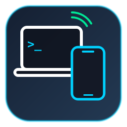

# Linux Continuity

An Apple-style continuity ecosystem between Linux PC and Android. Seamlessly transfer files, synchronize clipboards, and watch or control your Linux terminal right from your Android phone.

**Developer**: [killindodo](https://github.com/killindodo)  
**Repository**: [https://github.com/killindodo/linux-continuity](https://github.com/killindodo/linux-continuity)



---

## Why I Built This

I wanted the seamless continuity experience that Apple has between macOS and iPhone, but for Linux and Android:
1. **Interactive Terminal on Mobile**: Being able to watch running builds, tail server logs, or run bash/zsh commands from my phone when I step away from my desk.
2. **Universal Shared Clipboard**: Instantly sync clipboard between PC and phone without manually emailing or messaging links to myself.
3. **AirDrop-Style File Transfers**: Fast, wireless file dropping straight into `~/Downloads` without cables, cloud drives, or login portals.

This project delivers all of this over your local Wi-Fi network with **zero extra Android app installations required**—simply open the web hub in your mobile browser or scan the QR code on your desktop.

---

## Features

- 📟 **Real-Time Interactive Terminal**:
  - Full PTY terminal streaming powered by `xterm.js` and WebSockets.
  - Mobile touch helper keyboard with `ESC`, `TAB`, `Ctrl+C`, `Ctrl+Z`, and arrow keys.
  - Watch background tasks or run interactive shell commands directly from Android.
- 📋 **Universal Shared Clipboard**:
  - Live bidirectional clipboard synchronization.
  - Text copied on PC appears instantly on phone with 1-tap "Copy to Phone".
  - Text typed or pasted on phone is sent directly to the Linux X11 clipboard via `xclip`.
- 📁 **AirDrop File Drop**:
  - Send photos, documents, and videos from your phone directly to `~/Downloads` on Linux.
  - Triggers native desktop notifications on arrival.
  - Browse and download recent PC files from Linux to Android with one click.
- ⚡ **Desktop & Mobile Controls**:
  - Quick actions from mobile: Lock screen, desktop audio mute, ping PC.
  - Desktop companion app with auto-generated QR code for instant camera pairing.
  - System tray icon with quick links and downloads folder shortcut.

---

## Getting Started

### Prerequisites

Ensure Python 3 and standard Linux tools are installed:

```bash
# Debian / Ubuntu / Kali
sudo apt update
sudo apt install python3 python3-pyqt6 python3-tornado xclip
```

### Installation

```bash
git clone https://github.com/killindodo/linux-continuity.git
cd linux-continuity
./install_desktop.sh
```

---

## Usage

### 1. Launch the Desktop Hub

Run via terminal or your application launcher:

```bash
continuity
```

Or run headless in the background:

```bash
python3 server.py --port 8080
```

### 2. Connect from Android

1. Ensure your Android phone is connected to the same Wi-Fi network as your PC.
2. Point your phone camera at the QR code displayed on the desktop window (or open the displayed URL in your mobile browser, e.g., `http://192.168.x.x:8080`).
3. You now have full terminal access, live clipboard sync, and file dropping!

---

## Remote Access (When Away from PC)

When you are away from your PC (e.g., outside on 4G/5G mobile data or connected to different Wi-Fi networks), you can connect remotely using either of two built-in methods:

### Method A: Cloudflare Public Tunnel (1-Click, Zero Config)
Click **"☁️ Public Remote Tunnel"** -> **"⚡ Start Public Tunnel"** in the desktop app.
- Generates an encrypted public HTTPS URL (`https://*.trycloudflare.com`).
- Works worldwide on cellular data or any external Wi-Fi.
- Accessible from any browser with zero client app installation required on your phone.
- Protected by your 4-digit Security PIN.

### Method B: Tailscale Mesh VPN (Private Peer-to-Peer)
Click **"🌐 Tailscale VPN"** in the desktop app.
1. Connect your PC to Tailscale:
   ```bash
   sudo tailscale up
   ```
2. Install the free **Tailscale** app on your Android phone and sign in with the same account.
3. Open `http://<tailscale-ip>:8080` in your phone browser.
4. Enjoy a direct, end-to-end encrypted WireGuard connection anywhere in the world.

---

## Preventing Laptop Sleep While Away

To keep your Linux PC awake and connected when the lid is closed while away:

- **KDE Plasma**: System Settings -> Power Management -> When laptop lid is closed -> Select **"Turn off screen"** (instead of Sleep).
- **CLI / One-Liner**:
  ```bash
  systemd-inhibit --what=idle:sleep:handle-lid-switch --why="Remote Continuity" bash
  ```

---

## Background Autostart (Optional)

To have the Continuity server automatically start whenever you log into Linux:

```bash
systemctl --user enable --now linux-continuity
```

---

## Author

**killindodo**
- GitHub: [@killindodo](https://github.com/killindodo)
- Repository: [https://github.com/killindodo/linux-continuity](https://github.com/killindodo/linux-continuity)

---

## License

MIT License
